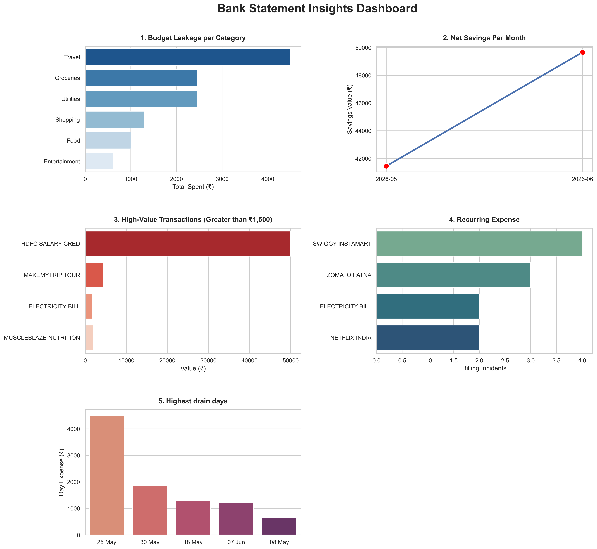

# Bank Statement Analysis Project
A Python project that cleans raw bank data, runs SQL analytics, 
and generates a visual dashboard.

## Tech Stack: Pandas, NumPy, SQLite, Seaborn, Matplotlib

## Features:
- Budget leakage per category
- Net savings per month
- Recurring expense detection
- High-value transaction alerts

